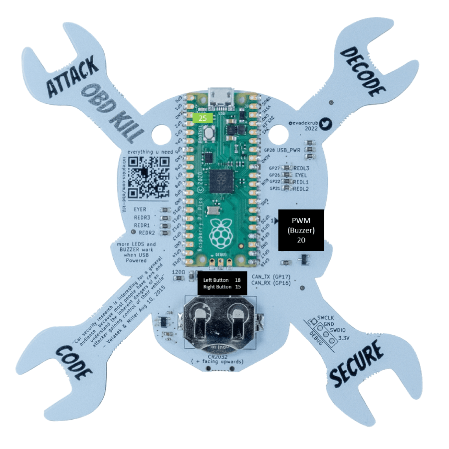

# A Tour of OBD-Kill Hardware

## 3. A Tour of OBD-Kill Hardware

### 3.1 Case and Overall Design

The OBD-Kill is enclosed in a lightweight circuit board. 13 LEDs, 2 buttons, CAN interface, and a Pulse Width Modulator are all built into this board. They can be easily controlled by using the Pin class and the pin numbers listed below.

### 3.2 Front Side and Pinout of Case

<figure>

<figcaption></figcaption>
</figure>

:::info[Note]
The pinout printed on the OBD-Kill for the Left and Right Buttons is reversed. The correct GPIO Pin for the left button is Pin 18 and the correct GPIO Pin for the right button is Pin 15.
:::

### 3.3 Back Side and Pinout of Case

<figure>

<figcaption></figcaption>
</figure>

:::info[Note]
The pinout printed on the OBD-Kill for the Pusle Width Modulator (Buzzer) is incorrect. The correct GPIO Pin is 20.
:::