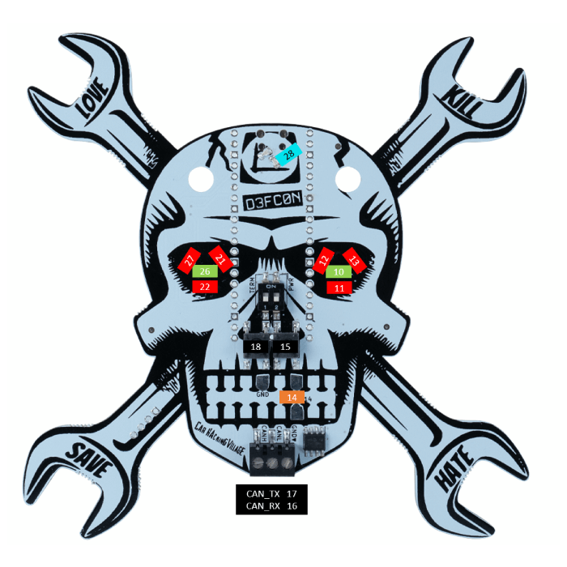

# OBD-Kill
#### Defcon Car Hacking Village Badge – Raspberry Pi Pico-Powered Automotive Hacking Badge

<figure>

<figcaption>OBD-Kill hardware</figcaption>
</figure>

test

<!-- ### Contents:

### 1. [Safety and Other Important Notices](/safety-and-other-important-notices)

### 2. [Introduction and Overview](/introduction-and-overview)

### 3. [A Tour of neoVI PI Hardware](/a-tour-of-neovi-pi-hardware)

### 4. [How to flash the neoVI PI CM4](/how-to-flash-the-neovi-pi-cm4)

### 5. [How to Disassemble & Reassemble neoVI PI](/disassemble-and-reassemble-neovi-pi)

### 6. [Software Setup](/software-setup)

### 7. [Control membrane LEDs and Trigger Button](/control-membrane-leds-and-trigger-button)

### 8. [Reference: Connector Pinouts and Cable Signal Mappings](/reference-connector-pinouts-and-cable-signal-mappings)

### 9. [Support Contact Information](/support-contact-information) -->